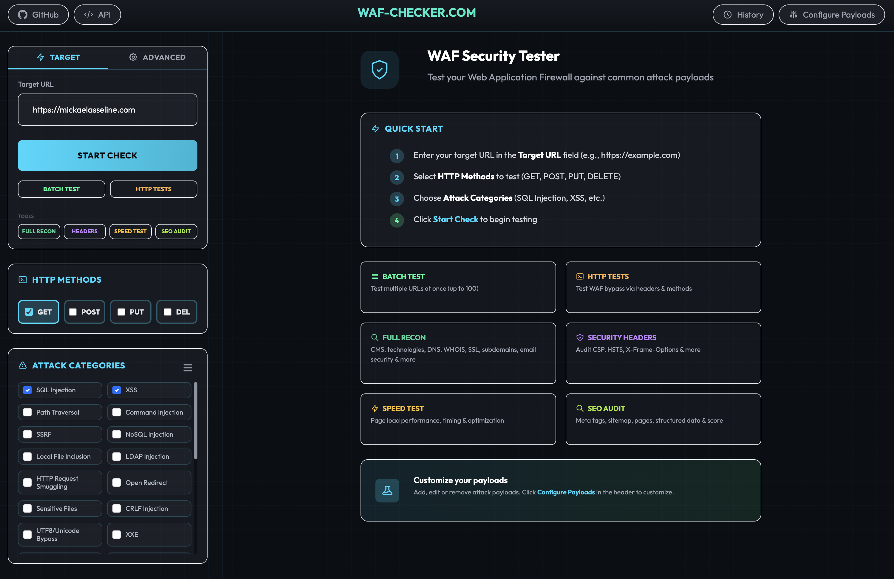
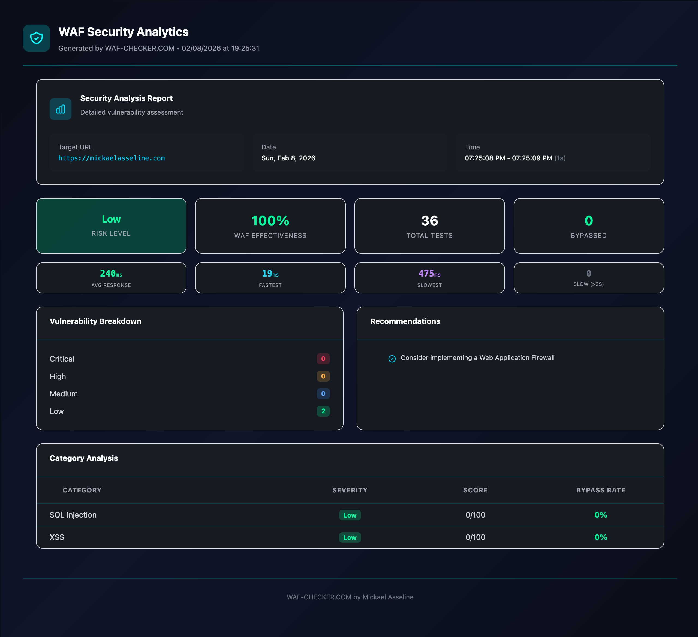
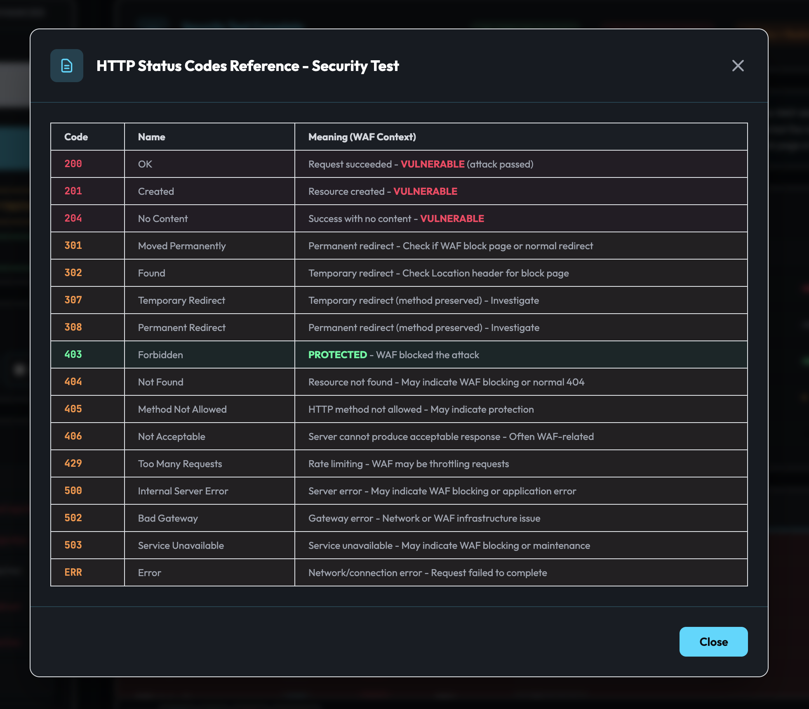
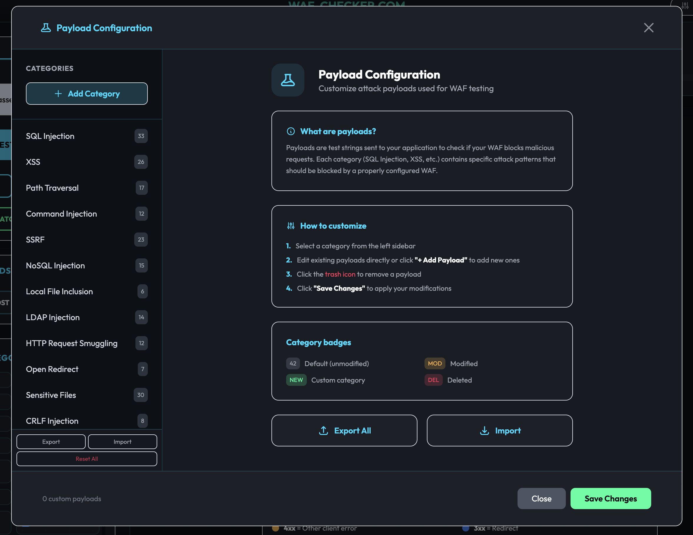
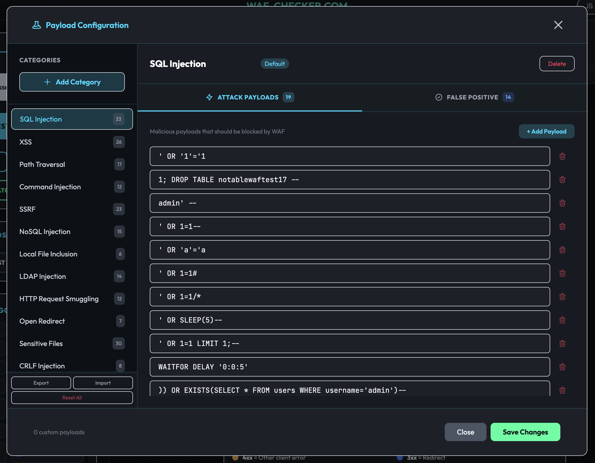
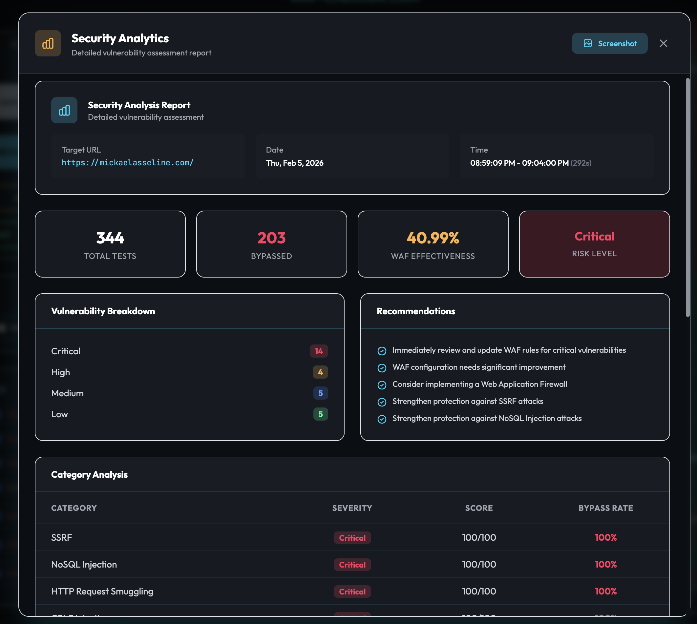
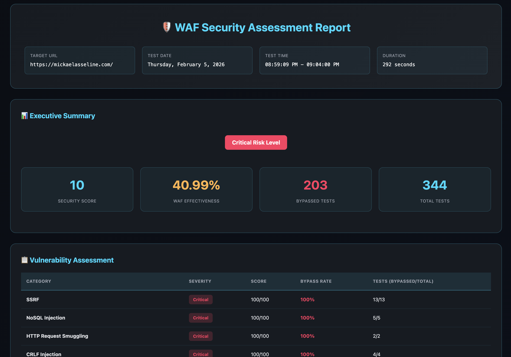

<p align="center">
  <a href="https://mickaelasseline.com">
    
  </a>
</p>

<p align="center">
  <a href="#"></a>
</p>
<div align="center">
A powerful web application to test how well your **Web Application Firewall (WAF)** protects against common attack vectors.
</div>


→ [waf-checker.com](https://waf-checker.com) ←




## Features

### Security Testing
- **19+ attack categories** out of the box: SQL Injection, XSS, Path Traversal, Command Injection, SSRF, NoSQL Injection, LFI, LDAP Injection, XXE, SSTI, CRLF, and more
- **9 advanced bypass categories** with encoding variations, protocol smuggling, and framework-specific payloads
- **344+ payloads** loaded dynamically from [PAPAMICA/waf-payloads](https://github.com/PAPAMICA/waf-payloads)
- **False positive testing** to verify legitimate traffic isn't being blocked
- **HTTP method testing** across GET, POST, PUT, and DELETE

### WAF Detection & Bypass
- **Auto WAF detection** — identifies Cloudflare, AWS WAF, Imperva, ModSecurity, Akamai, F5 BIG-IP, and 15+ other WAFs
- **Advanced bypass techniques** — double encoding, unicode, mixed case, comment obfuscation
- **WAF-specific bypass generation** — tailored strategies per detected WAF
- **HTTP manipulation testing** — verb tampering, parameter pollution, content-type confusion, request smuggling

### Real-Time Results



- **Streaming results** via Server-Sent Events (SSE) — see results as they come in
- **Color-coded status codes**:
  - `403` green — WAF blocked the attack (protected)
  - `200` red — payload passed through (vulnerable)
  - `3xx` orange — redirect (requires investigation)
  - `4xx` yellow — other client error
- **Filterable results** by status code with real-time summary bars

### HTTP Status Reference



### Payload Configuration

Fully customizable payload management through the built-in configuration panel:





- Browse all categories with payload counts
- Add, edit, or remove individual payloads
- Create custom categories
- Separate **attack payloads** and **false positive** payloads per category
- Export/import payload configurations
- Changes persist in localStorage

### Security Analytics

Detailed vulnerability assessment reports with scoring:



- **WAF effectiveness score** — percentage of attacks blocked
- **Risk level assessment** — Critical, High, Medium, Low
- **Vulnerability breakdown** by severity
- **Category-level analysis** with bypass rates
- **Actionable recommendations**

### HTML Report Export



- Export results as **JSON**, **CSV**, or **HTML** report
- Professional HTML report with executive summary
- Per-category vulnerability assessment with scores
- Screenshot support for sharing

### Batch Testing
- Test **up to 100 URLs** simultaneously
- Concurrent processing with progress tracking
- Per-URL results with bypass rate analysis

## Architecture

WAF-Checker is built as a **Cloudflare Worker** with static assets:

- **Backend** (`app/src/api.ts`) — Worker handling API requests, payload delivery, and WAF testing
- **Frontend** (`app/src/static/`) — Single-page app with cyberpunk UI
- **Payloads** — Loaded dynamically at runtime from [GitHub](https://github.com/PAPAMICA/waf-payloads) to keep the worker bundle clean

### Project Structure

```
wrangler.toml                  # Cloudflare Worker configuration
app/src/
├── api.ts                     # Main Worker entry point & API routes
├── payloads.ts                # Payload types (data loaded from GitHub)
├── advanced-payloads.ts       # Encoding & bypass generation functions
├── encoding.ts                # WAF bypass encoding utilities
├── waf-detection.ts           # WAF fingerprinting & detection
├── http-manipulation.ts       # HTTP protocol manipulation techniques
├── reporting.ts               # Export & analytics module
├── batch.ts                   # Batch testing module
└── static/
    ├── index.html             # Main web interface
    ├── main.js                # Frontend logic & UI
    ├── style.css              # Cyberpunk theme & styling
    └── favicon.svg            # App icon
```

## Getting Started

### Prerequisites
- [Node.js](https://nodejs.org/) (v18+)
- [Wrangler CLI](https://developers.cloudflare.com/workers/wrangler/install-and-update/)

### Local Development

```bash
# Clone the repository
git clone https://github.com/PAPAMICA/waf-checker.git
cd waf-checker

# Install dependencies
npm install

# Start local dev server
npx wrangler dev
```

Open `http://localhost:8787` in your browser.

### Deployment to Cloudflare

1. **Login to Cloudflare:**
   ```bash
   npx wrangler login
   ```

2. **Update `wrangler.toml`** with your `account_id`

3. **Deploy:**
   ```bash
   npx wrangler deploy
   ```

## Extending Payloads

Payloads are maintained in a separate repository: [PAPAMICA/waf-payloads](https://github.com/PAPAMICA/waf-payloads)

To modify the default payloads:
1. Fork or edit the [payloads.json](https://github.com/PAPAMICA/waf-payloads/blob/main/payloads.json)
2. Update the `GITHUB_PAYLOADS_URL` in `app/src/api.ts` if using a custom source

You can also add custom payloads directly in the web interface via **Configure Payloads** — changes are saved in your browser's localStorage.

## License

MIT

---

Built by [Mickael Asseline](https://github.com/PAPAMICA)
